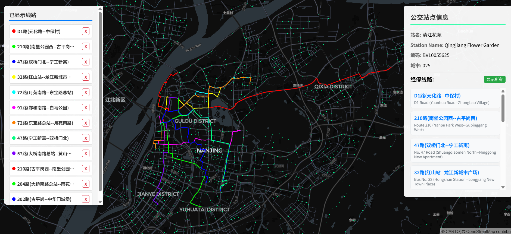

# BusMetroExplorer

> [!WARNING]
> 本项目为vibe coding，代码质量较差，仅供学习参考。

busrouter.sg but for China

类似[busrouter.sg](https://busrouter.sg)的全国公交线路和站点可视化工具。采用数据集为[CPTOND2025](https://figshare.com/articles/dataset/CPTOND-2025/29377427)。

功能：
- 查看全国超过80万个公交站点的位置和途经线路
- 查看公交线路详情、停靠站、运营公司等
- 自定义显示多条线路的路线图
- 查看停靠一个车站的所有路线图

目前局限：
- 只有公交数据
- 数据质量来自CPTOND2025，可能存在错误和不完整
- 英文翻译来自源数据集，看个乐就行

